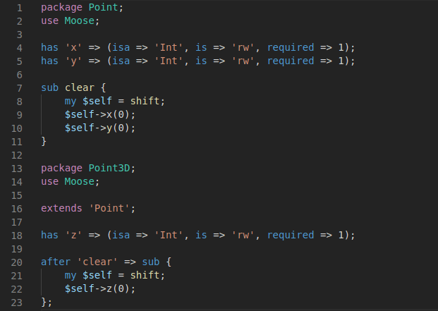

# Perl Moose Extension for VS Code

[](https://travis-ci.org/torrentalle/vscode-perl-moose)

Visual Studio Code support for Perl [Moose](https://metacpan.org/pod/Moose) and [Moo](https://metacpan.org/pod/Moo).

This extension is developed following [Moose::Cookbook::Snack::Keywords](https://metacpan.org/pod/distribution/Moose/lib/Moose/Cookbook/Snack/Keywords.pod)
guidelines with some additions

## Features

This extensions includes Syntax Highlight for:

* **Moose** and **Moo**
* **Moose::Role**
* **Moose::Util::TypeConstraints**



## Release Notes

See [CHANGELOG.md](CHANGELOG.md) to see latest changes

## Contributing

The main grammar is stored in [syntaxes/perl-moose.tmLanguage.json](syntaxes/perl-moose.tmLanguage.json).
This file is generated from [src/syntaxes/perl-moose.tmLanguage.yaml](src/syntaxes/perl-moose.tmLanguage.yaml):

## Building

To generate the main grammar:

```bash
$ npm install
$ npm run build
```

## Testing

To run the grammar tests:

```bash
$ npm run test
```
The test cases are stored as markdown files under `testFixture/colorize-fixtures`. Grammar test results are stored under `testFixture/colorize-results`, which are automatically generated from the fixtures.

To test the grammar in VS Code, select the `Extension Tests` configuration in the VS Code debugger and run.
